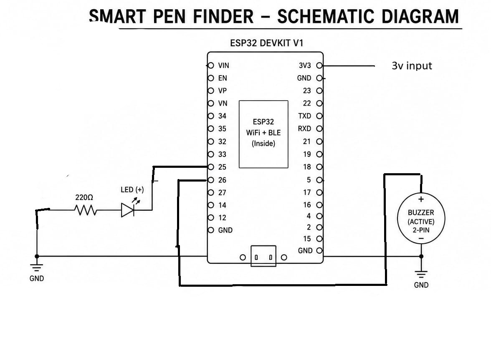
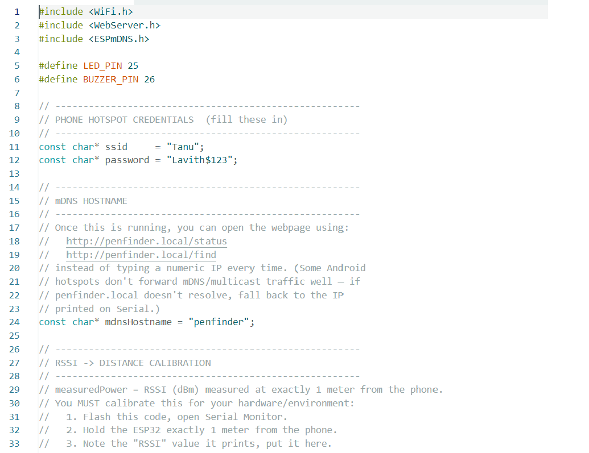
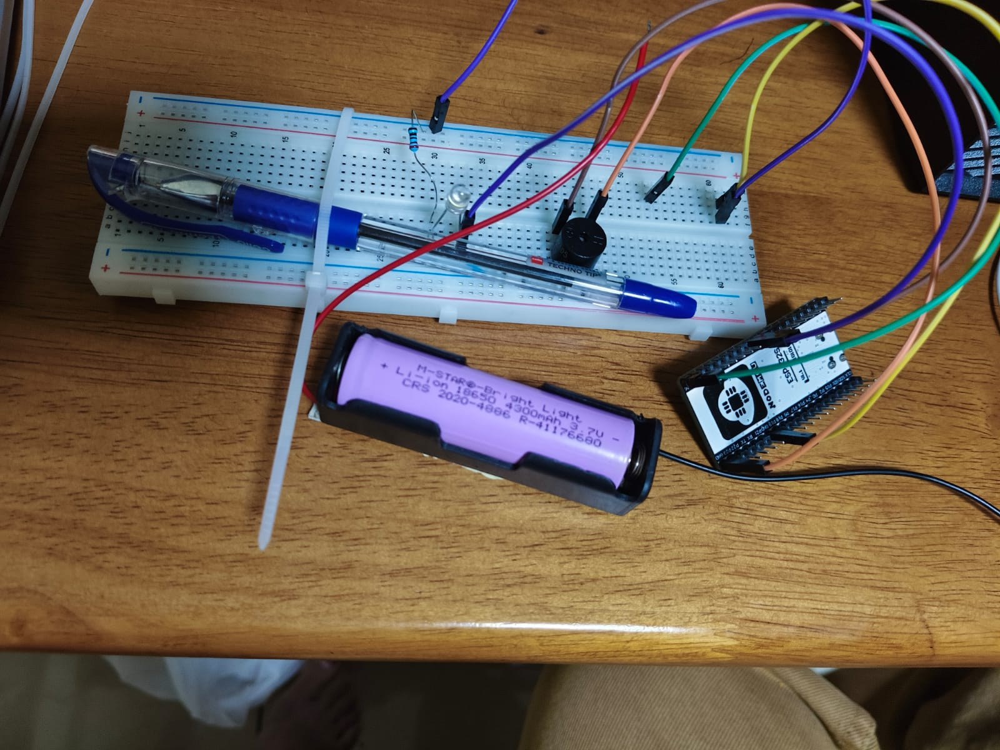
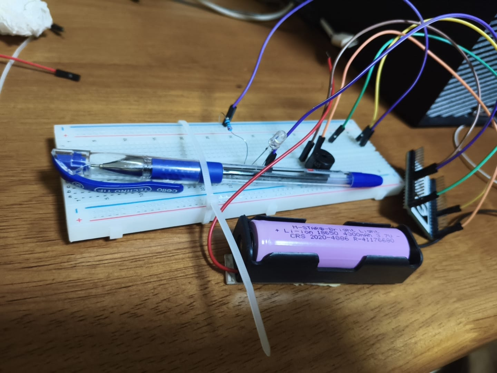
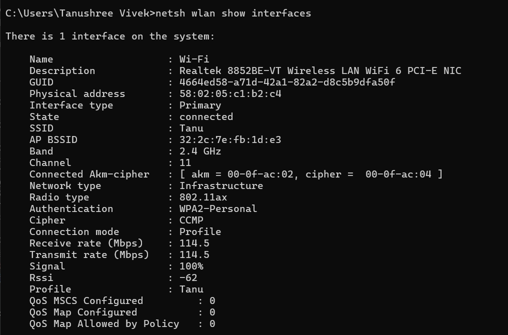
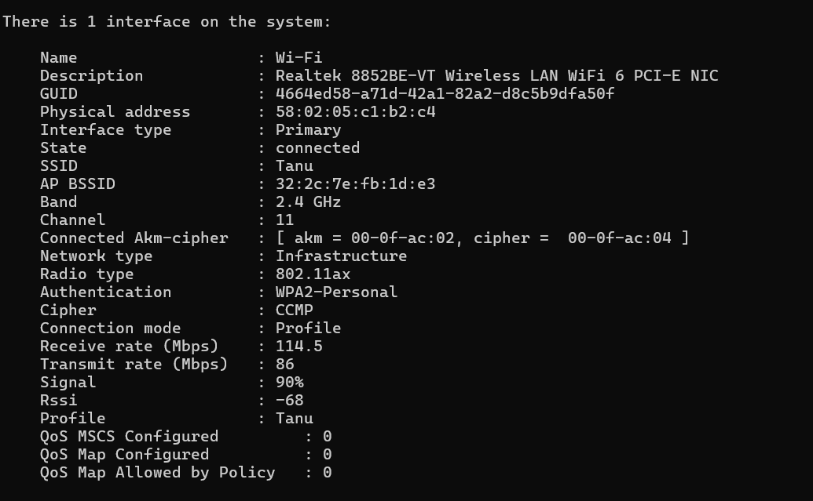

# കമ്പിളിപ്പുതപ്പ്....കമ്പിളിപ്പുതപ്പ്.....
tagline : Detecting distance, destroying common sense.” 💀

## Basic Details
### Team Name: Idiots

### Team Members
- Team lead: Tanushree - MEC
- Member 2: Adhiya - MEC

### Project Description
To build a Wi-Fi-based ESP32 system that detects how close you are to your pen—and then does the exact opposite of what a useful device should do, because apparently the pen has trust issues.”

### The Problem (that doesn't exist)
To find mec pen thief

### The Solution (that nobody asked for)
to not find the pen( helping the thief)

## Technical Details
### Components Used
For Hardware:
- ESP32 DEVKIT V1
- LED
- RESISTOR
- JUMPER WIRE
- BREAD BOARD
- BUZZER
- HOLDER

SOFTWARE TOOLS
- AURDINO IDE
- ESP BOARD PACKAGE
- C/C++ AURDINO PROGRAMING 
- ESP32 Wifi FUNCTIONALITY 

# Schematic & Circuit

Schematic Diagram Explanation
The Smart Pen Finder schematic shows how the ESP32 DevKit V1 controls an LED and a buzzer to help locate a misplaced pen using Bluetooth Low Energy (BLE).

⚙️ Power Supply
The circuit is powered by 5 V USB.
The VIN pin of the ESP32 receives 5 V, and GND connects to the common ground.
The onboard voltage regulator converts 5 V to 3.3 V for internal operation.

💡 LED Indicator
GPIO 25 is connected to a 220 Ω resistor, then to the LED’s anode (+).
The LED’s cathode (−) connects to GND.
When the ESP32 receives a “Find” command, GPIO 25 goes HIGH, lighting the LED — a visual cue that the pen is nearby.

🔊 Buzzer Alert
GPIO 26 connects to the positive (+) terminal of an active buzzer.
The negative (−) terminal of the buzzer connects to GND.
When triggered, the buzzer emits a short beep — an audible signal to locate the pen.

# CODE EXPLANATION

- "#include <WiFi.h>" – Includes the Wi-Fi library to connect the ESP32 to the phone hotspot.
- "#include <WebServer.h>" – Creates a web server on the ESP32.
- "#include <ESPmDNS.h>" – Allows the ESP32 to be accessed using "penfinder.local".

- "#define LED_PIN 25" – Assigns GPIO 25 to the LED.
- "#define BUZZER_PIN 26" – Assigns GPIO 26 to the buzzer.
- "ssid" and "password" – Store the phone hotspot name and password.
- "DISTANCE_THRESHOLD_M = 1" – Sets the distance limit to 1 meter.
- "rssiToDistance()" – Converts the Wi-Fi RSSI value into an estimated distance.
- "getSmoothedRssi()" – Averages multiple RSSI readings to reduce fluctuations.
- "handleFind()" – Activates the LED and buzzer when the FIND command is received.
- "handleStatus()" – Sends the current RSSI and near/far status.
- "connectToHotspot()" – Connects the ESP32 to the phone's hotspot.
- "setup()" – Runs once when the ESP32 starts and initializes the pins, Wi-Fi, and web server.
- "loop()" – Runs continuously and checks the RSSI, calculates distance, and controls the LED and buzzer.
- "digitalWrite()" – Turns the LED or buzzer ON or OFF.
- "WiFi.RSSI()" – Reads the Wi-Fi signal strength.
- "millis()" – Measures elapsed time without stopping the program.
Main Logic
"WiFi.RSSI()" → "getSmoothedRssi()" → "rssiToDistance()" → Compare with "DISTANCE_THRESHOLD_M" → Control LED and buzzer.
If distance is ≤ 1 m: LED OFF, Buzzer OFF.
If distance is > 1 m: LED ON, Buzzer ON.
# Principle
Pen Finder is a small IoT-based hardware prototype designed to help locate a misplaced pen. The system uses an ESP32 and RSSI (Received Signal Strength Indicator) to estimate the distance between the pen and a smartphone.
When the phone is within a predefined distance of 1 meter, the LED and buzzer remain OFF. When the phone moves farther than 1 meter, the system activates the LED and buzzer to indicate that the pen is away from the phone.
The project combines Wi-Fi communication, RSSI-based distance estimation, and simple hardware indicators to create a fun and practical prototype.

# Build VIDEO
PART 1 : https://drive.google.com/file/d/1cS-AXpPOhCevjrnCTvFUu4hDCgUFLhzS/view?usp=drivesdk

PART 2: https://drive.google.com/file/d/1-PblNKgPnnBa4HVxVe-KqKRfFsz5LhMi/view?usp=drivesdk

PART 3: https://drive.google.com/file/d/1j_1MecdwCtXjqvmTFoPYLezJuHrBN5iL/view?usp=drivesdk

FINAL IMAGE 

### Project Demo
# Video
DEMO VIDEO : https://drive.google.com/file/d/1V2NurYn7AOfwtSOS2UqLg-yf4xCF327G/view?usp=drivesdk

“This is our Pen Finder prototype. The main idea is to detect whether the phone is near or far from the pen using the ESP32's wireless signal strength, called RSSI.”
“First, we keep the phone close to the pen. The ESP32 receives a stronger signal, so the estimated distance is within our 1-meter threshold. In this condition, both the LED and buzzer remain OFF.”
“Now, when I move the phone farther away, the RSSI becomes weaker. The ESP32 estimates that the distance has crossed 1 meter, so it activates the LED and buzzer as an alert.”
“Therefore, instead of searching everywhere for the pen, the user can simply use the signal-based alert to know whether the phone is within the defined range of the pen.”

RSSI MEASURE: 

## Team Contributions
- Adhiya: everything
- Tanushree: everything

---
Made with ❤️ at TinkerHub Useless Projects 

